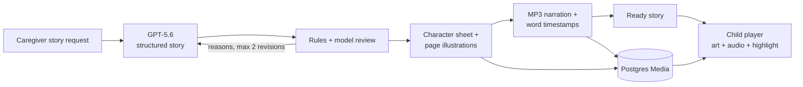

# Beboo

> A calm companion that turns any new situation into your child's own story.

**OpenAI Build Week · Education**

Beboo helps a caregiver prepare an autistic child (roughly ages 4–10) for an
unfamiliar moment—such as a dentist visit, a fire drill, or a changed
plan—through a personalized, illustrated social story. The child gets a quiet,
predictable reading experience; the caregiver gets the tools to create and
review stories behind a PIN.

Beboo is a support tool for practice and preparation, guided by a caregiver.
It is not a replacement for therapy or professional care.

## Why Beboo

New situations can be difficult when they are vague, fast, or unpredictable.
Beboo turns a situation into a short, literal story with a calm outcome. It is
designed around predictable layout, muted visuals, familiar emotion symbols,
and child control rather than stimulation or performance.

- No autoplay, sound effects, scores, streaks, timers, red error states, or
  child-visible failure states.
- Story text appears immediately; the only text movement is an optional
  word-level highlight that follows narration.
- The same eight gentle emotion faces appear in stories, check-ins, practice,
  and the parent summary.
- A wrong check-in answer leads to a warm cue and another look, never a
  penalty.
- Reduced motion respects both a child profile preference and the browser's
  `prefers-reduced-motion` setting.

## What is included

### Child experience

- A large-cover story shelf with three validated seed stories: dentist,
  fire-drill, and changed-plan preparation.
- A full story player with page progress, slow Ken Burns art, instant readable
  text, tap-only narration, and word-synchronized karaoke highlighting.
- Gentle emotion check-ins with a scaffold after the first miss and a warm
  reveal after the second.
- A bridge question and a calm ending with **Read again** and **My stories**.
- A fixed **Practice** area:
  - **How I feel now** records one of eight feelings without scoring.
  - **Breathe with BeBoo** is a tap-start, skippable breathing exercise.
  - **Squeeze and hug** offers static, literal calming guidance.

### Caregiver experience

- First-run onboarding for a first name, pronouns, reading level, interests,
  companion, and sensory preferences; audio autoplay is always disabled.
- A discreet 4-digit PIN gate for the parent area.
- A story wizard for health, school, daily-life, social, or custom situations,
  with 3–6 pages and optional check-ins.
- A three-stage progress view for writing, drawing, and voice generation.
- A library, read-only profile view, and a calm seven-day feelings summary.
- A fallback to an appropriate seed story if a generated story cannot finish.

## A quick judge demo

1. Complete onboarding and open a seeded story to show the calm, no-backend
   child experience.
2. Open **Grown-up area**, enter the chosen PIN, and select **Make a story**.
3. Choose a situation, page length, and whether to include check-ins.
4. Show the parent-facing **Writing → Drawing → Recording the voice** status.
5. Open the ready story from the shelf, tap the speaker, and point out the
   synchronized word highlight.
6. Show a warm check-in retry, then visit Practice and the parent feelings
   summary.

The full AI path needs a configured database and OpenAI API key. The three
seed stories make the child experience demoable without either one.

## The generation pipeline



| Stage | OpenAI capability | What Beboo does |
| --- | --- | --- |
| Write | `TEXT_MODEL` (`gpt-5.6` default) | Produces strict JSON for a 3–6 page social story using the child's reading level, interests, companion, situation, and target emotions. |
| Review | `TEXT_MODEL` (`gpt-5.6` default) | Applies deterministic child-safety checks plus a qualitative review. Failed drafts receive specific revision reasons, with at most three drafts total. |
| Draw | `IMAGE_MODEL` + `IMAGE_QUALITY` | Makes one cached character sheet, then uses image edits to keep each recurring character consistent across soft-3D story pages. The development defaults are `gpt-image-1-mini` and `low`; the flagship demo uses `gpt-image-2` and `high`. |
| Voice | `TTS_MODEL` (`gpt-4o-mini-tts` default) | Creates a calm MP3 for each generated page using `TTS_VOICE=marin` by default, with a story-wide `cedar` fallback. |
| Synchronize | `whisper-1` (fixed) | Transcribes each MP3 with word timestamps. Trusted maps are saved; otherwise the player derives proportional ranges from the real audio duration. |

The player uses `HTMLAudioElement.currentTime` as its clock, not a separate
timer. That keeps the highlighted word synchronized when a child pauses,
replays, or uses the caregiver-selected 0.8× narration speed.

Generated images and audio are stored as content-hashed `bytea` records in
Postgres and served through `GET /api/media/:id` with immutable cache headers.
This keeps the app to one deployable service and avoids a separate media host.

Page drawing and narration use a bounded concurrency of three. Each page is
retried independently; a remaining page failure still leaves the story in its
existing calm failed/retry state rather than presenting a partial story.

Page-image cache keys are derived from
`hash(styleBlock + characterBlock + scene + model + quality)`. Page edits use
the saved character sheet as their reference: GPT Image 2 applies high input
fidelity automatically, so its request omits `input_fidelity`; other supported
image-edit models send `input_fidelity: "high"` for character consistency.

## Architecture

- **Frontend:** React 18, Vite, TypeScript (strict), Tailwind CSS, and React
  Router.
- **Backend:** Node 20, Express, TypeScript, Zod validation, Prisma, and
  PostgreSQL (Neon is the documented target).
- **Data boundary:** `frontend/src/lib/api.ts` is the only frontend data
  boundary. It keeps the seed-mode child flow working without a backend and
  merges ready database stories when the API is available.
- **Deployment model:** Express serves `frontend/dist` in production, so one
  web service exposes both the SPA and `/api` routes.

See [docs/ARCHITECTURE.md](docs/ARCHITECTURE.md) for the schema, route
contracts, deployment notes, and design rationale.

## Run locally

### Prerequisites

- Node.js 20 or later
- PostgreSQL for the full generation flow (a Neon database is recommended)
- An OpenAI API key for generation, images, narration, and word timing

### Child-flow demo only (no database or API key)

The seed shelf, onboarding, story player, check-ins, and Practice area run in
the frontend's local/mock mode.

```sh
npm ci
npm run dev:frontend
```

Open [http://localhost:5173](http://localhost:5173), complete the local
onboarding flow, and choose a seeded story.

### Full generation flow

```sh
npm ci
cp backend/.env.example backend/.env
```

On Windows PowerShell, use:

```powershell
Copy-Item backend/.env.example backend/.env
```

Set these values in `backend/.env`:

| Variable | Required | Purpose |
| --- | --- | --- |
| `DATABASE_URL` | Yes | PostgreSQL/Neon connection string. |
| `OPENAI_API_KEY` | Yes for generation | Server-only OpenAI key. Never commit it. |
| `PORT` | No | Express port; defaults to `3001`. |
| `TEXT_MODEL` | No | Defaults to `gpt-5.6`; the example/demo setting is `gpt-5.6`. |
| `IMAGE_MODEL` | No | Development default: `gpt-image-1-mini`; flagship demo setting: `gpt-image-2`. |
| `IMAGE_QUALITY` | No | Defaults to `low`; the flagship demo uses `high`. |
| `TTS_MODEL` | No | Defaults to `gpt-4o-mini-tts`. |
| `TTS_VOICE` | No | Defaults to `marin`; `cedar` is the fallback. |

`whisper-1` is intentionally fixed in code for transcription because karaoke
sync requires `timestamp_granularities: ["word"]`.

Then migrate, seed, and start both workspaces:

```sh
npm run prisma --workspace=@beboo/backend -- migrate dev
npm run seed
npm run dev
```

The frontend runs at [http://localhost:5173](http://localhost:5173) and
proxies `/api` requests to Express at `http://localhost:3001`.

To generate a story: complete onboarding, open the discreet **Grown-up area**
button on the shelf, enter the PIN you chose, then choose **Make a story**.

## Quality checks

```sh
npm run typecheck
npm run lint
npm run test
npm run build
```

The current test suite covers non-trivial story validation, backend narration
timing alignment and fallback behavior, and frontend timing helpers.

## API at a glance

All API inputs are Zod-validated and all responses are JSON unless serving
media.

| Area | Routes |
| --- | --- |
| Health | `GET /api/health` |
| Parent PIN | `POST /api/pin/verify` |
| Child data | `GET/POST /api/children`, `GET/PATCH/DELETE /api/children/:id` |
| Stories | `POST /api/stories/generate`, `GET /api/stories`, `GET /api/stories/:id`, `GET /api/stories/:id/status` |
| Practice and check-ins | `POST /api/practice/feelings`, `POST /api/checkins`, `GET /api/dashboard/:id` |
| Media | `GET /api/media/:id` |

For full request shapes, see [docs/PRODUCT.md](docs/PRODUCT.md) and
[backend/src/schemas.ts](backend/src/schemas.ts).

## Privacy and safety notes

- Beboo does not ask for child photos or user accounts. The onboarding profile
  identifies a child by first name and preferences needed to personalize the
  experience.
- OpenAI calls happen only on the server; browser code never receives the API
  key.
- The backend child-delete route cascades child-linked stories, pages,
  check-ins, feelings, and unreferenced generated media in one transaction.
- Generated stories and narration are AI-generated. Caregivers should review
  a story before sharing it with a child.
- This hackathon prototype does **not** make COPPA, HIPAA, or production
  security-compliance claims. It needs authentication, authorization,
  consent/retention policies, and a formal security review before use with
  real families at scale.

### Current prototype boundaries

The product intentionally has a small, demonstrable scope:

- Onboarding, the demo PIN, reading recency, and child-flow check-in attempts
  currently live in browser local storage; the backend bridges the profile for
  story generation and Practice feeling logs.
- The API can store check-ins and exposes raw progress data, but the adaptive
  emotion-selection loop is not yet wired into the child flow.
- Parent settings are shown read-only after onboarding in this build.
- Generation runs in-process. If the server restarts mid-generation, the
  story becomes `failed` and the caregiver sees the calm retry/fallback path.

These boundaries are documented so the demo stays honest about what is live
today and what would be hardened next.

## Deployment

The intended low-cost deployment is one Render web service plus Neon
PostgreSQL:

```sh
npm run build
npx prisma migrate deploy --schema backend/prisma/schema.prisma
NODE_ENV=production node backend/dist/index.js
```

On Windows PowerShell, start the final command with:

```powershell
$env:NODE_ENV = 'production'; node backend/dist/index.js
```

Configure `DATABASE_URL`, `OPENAI_API_KEY`, `PORT`, `TEXT_MODEL`,
`IMAGE_MODEL`, `IMAGE_QUALITY`, `TTS_MODEL`, and `TTS_VOICE` in the host. Run
`npm run seed` once from the deployed shell. The example/demo configuration is
`TEXT_MODEL=gpt-5.6`, `IMAGE_MODEL=gpt-image-2`, and `IMAGE_QUALITY=high`;
the runtime image defaults remain `gpt-image-1-mini` and `low` when omitted.

When `NODE_ENV=production`, Express serves `frontend/dist`. Render's free
service may take about a minute to wake after idling; open the URL once before
a demo. Hosting can remain free at hackathon scale, while OpenAI API use is
metered or credit-backed.

## Built with Codex + GPT-5.6

This project was built in Codex as an OpenAI Build Week submission. Codex
accelerated the end-to-end work: workspace and Prisma scaffolding, the calm
design system, React flows, strict API contracts, generation safety rules,
audio synchronization, tests, smoke checks, and this documentation.

GPT-5.6 is part of the runtime product, not just the development process: it
creates the structured social story and performs its bounded
quality review. The remaining OpenAI stages generate consistent illustration
assets, narration, and word-level timing data that make the story playable.

## Project guides

- [Product specification](docs/PRODUCT.md)
- [Brand and child-safety rules](docs/BRAND.md)
- [Story-generation rules](docs/STORY_RULES.md)
- [Architecture and deployment notes](docs/ARCHITECTURE.md)
- [Practice specification](docs/PRACTICE.md)
- [Build log](docs/BUILD_LOG.md)

## License

Released under the [MIT License](LICENSE).
